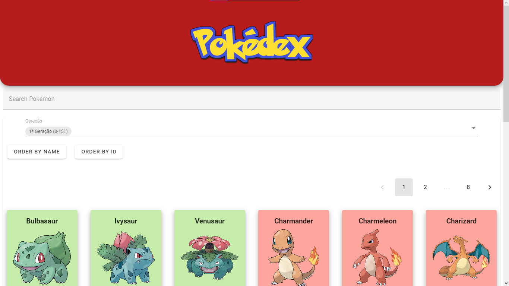
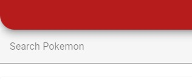
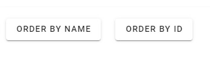
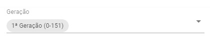
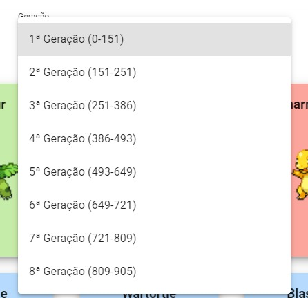
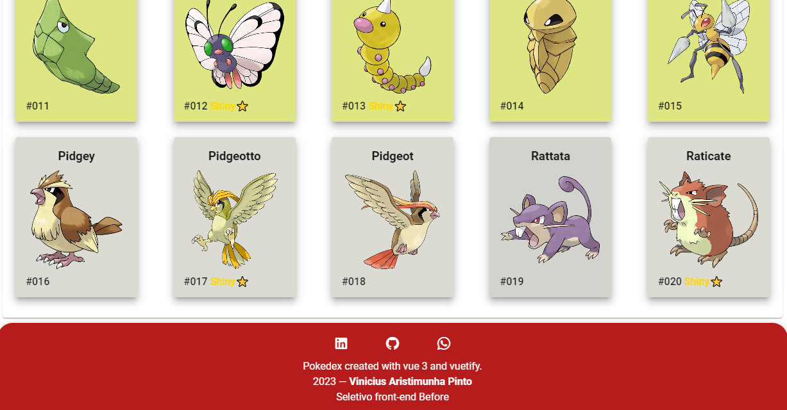
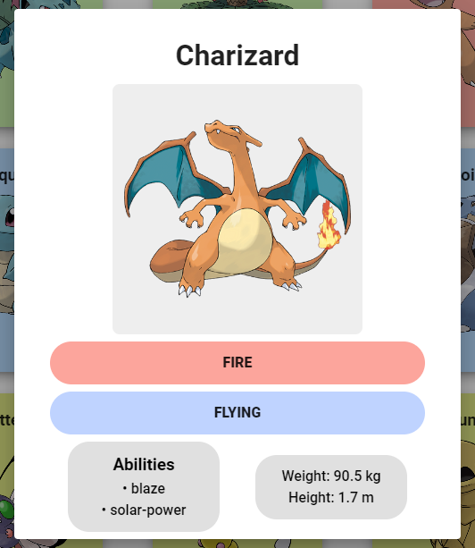

# <h1>Pokedex with vue 3, vuetify and Pokeapi</h1>

Acesso ao projeto: <a target="_blank">https://prova-est-front-vinicius-aristimunha.vercel.app</a>

Para executar o projeto basta clonar o repositório e dentro dele pelo terminal executar os seguintes comandos: 

```
 cd '(pasta do projeto)'    
 npm install
 npm run dev
```


<h2>Principais funcionalidades</h2>




<p>A página apresenta algumas opções de escolha a primeira vista, são elas:</p>
<br> 

<p>Representa um input text que está vinculado a busca de pokemons por nome e tipo.</p>

<br>

<p>Representa dois botões que fazem a ordenação da lista atual(geração) de pokemon por seus nomes em ordem alfabética ou em por seus IDs em ordem numérica crescente.</p>

<br>


<p>Seletor de geração de pokemons, seleciona a geração desejada e mostra os pokemons respectivos</p>

<br>

<p>Rodapé da página apresenta um simples menu social com os links para </p>
<ul>
      <li><a href="http://wa.me/+5567981814185">Whatsapp</a></li>
      <li><a href="http://www.linkedin.com/in/viniaris">Linkedin</a></li>
      <li><a href="http://github.com/viniciusarisp">Github</a></li>
</ul>

<p>Além disso ao clicarmos na carta de algum Pokémon na lista recebemos o seu Card destacado</p>

<p>No card de pokemon podemos observar algumas informações extras como:</p>
<ul>
      <li>Seus tipos</li>
      <li>Habilidades</li>
      <li>Peso e altura</li>
</ul>

<h2>Agora a descrição da funcionalidade e descrição dos metódos usados na construção do app em vue</h2>

<p>Como dito antes eu nunca havia feito nada em Vue então a finalização desse desafio também representa pra mim a capacidade que tive de aprender gradativamente a construir essa interface para depois ir lentamente polindo suas estruturas, componentes, etc.</p>

<p>A primeiro momento criei uma aplicação vue e tentei entender a sua estrutura aos poucos </p>

<p>Depois de me familiarizar um pouco com as estruturas de componentes e do app.vue adicionei o framework ou biblioteca que mais me foi útil durante a construção dessa aplicação: Vuetify, um framework de componentes para Vue</p>

<p>Como primeiro passo estruturei meus requests na Pokeapi através do arquivo pokeapi.js presente em src/methods</p>

```javascript
//biblioteca axios para fazer requisições HTTP
import axios from 'axios';

export async function getList(url) {
  try {
    // Faz uma requisição GET à URL passada como parâmetro
    const response = await axios.get(url);
    // Faz uma requisição GET para cada item da lista retornada pela primeira requisição
    const requests = response.data.results.map(item => axios.get(item.url));
    // Aguarda a conclusão de todas as requisições
    const results = await Promise.all(requests);
    // Atualiza a lista de pokémons com os dados obtidos nas requisições
    return results.map(itemResponse => parsePokemon(itemResponse.data));
  } catch (error) {
    console.error(error);
  }
}

export function parsePokemon(pokemon) {
  return {
    "id": pokemon.id,
    "name": pokemon.name,
    "height": pokemon.height / 10, //converter para M
    "weight": pokemon.weight / 10, // converter para kg
    "abilities": pokemon.abilities.map(item => item.ability.name),
    "types": pokemon.types.map(item => item.type.name),
    "sprite": Math.random() > 0.1 ? 
    `https://raw.githubusercontent.com/PokeAPI/sprites/master/sprites/pokemon/other/official-artwork/${pokemon.id}.png` 
    : 
    `https://raw.githubusercontent.com/PokeAPI/sprites/master/sprites/pokemon/other/official-artwork/shiny/${pokemon.id}.png`,
  }
}
```

<p>Nesse arquivo exporto duas funções: getlist e parsepokemon</p>

<p>getlist faz o pedido da lista de pokemons para a pokeapi e parsepokemon trata todos dados recebidos para que fiquem em um objeto novo</p>

<p>Em app.vue (src/app.vue) defino metódo getList também como parte do componente App e importo a função getlist de pokeapi.js</p>

```javascript
//Importa o metódo que gera a lista de pokemons
import { getList } from './methods/pokeapi';
<script>
  data() {
    return {
      // Array de objetos com as informações dos Pokémon
      pokemons: [],
    }
  },
methods: {
    //Chama a função getList importada da pokeapi.js
    async getList(url){
      this.pokemons = await getList(url)
    }
  }
<script>
```
<p>a partir de agora basta chamar o metódo getlist no app principal passando uma url para que os dados de pokemons receba os pokemons solicitados e partir dai possamos criar o template com uma lista de pokemons<p>

<p>No template temos a seguinte estrutura:</p>

```vue
<template>
  <v-app>
    <MainHeader />
    <!-- Mainlist devolve o Pokémon e a geração(url) selecionado para app.vue --> 
    <MainList :pokemons="pokemons" @selectPokemon="setPokemon($event)" @urlAPI="this.getList($event)"/>
    <!-- pokemonCard Recebe o Pokémon selecionado após ser definido na função setPokemon -->
    <pokemonCard :selectedPokemon="selectedPokemon" v-model="showCard" />
    <MainFooter />
  </v-app>
</template>
```

<p> MainHeader é o primeiro dos nossos componentes e cabeçalho da página<br>MainList o main contendo a principal função do app<br>pokemonCard que é um 'pop-up'<br>Por fim MainFooter que é o rodapé</p>

<p>Entendendo afundo o MainList, em sua tag ele recebe um parametro de app.vue que são os dados de pokemons citado anteriormente. Além disso ele manda dois dados para app.vue, o primeiro é selectedPokemon que vamos entender mais pra frente e o segundo é urlAPI que se refere a url que será utilizada na função getList explicada anterior mente</p>

<p>E como ele define essa url?</p>

```
data: () => ({
    //Url do request para a api dependendo de cada geração
    url: 'https://pokeapi.co/api/v2/pokemon?limit=151&offset=0'
})
```
<p>Em MainList.vue (src/components/MainList.vue) temos como propriedade de dado do componente a primeira url definida que corresponde ao dado dos pokemons da primeira geração(1-151) </p>

<p>Além disso temos a função setGeneration também definida por:</p>

```vue
<script>
methods: {
  setGeneration(selectedGeneration) {
      //Separa os números de ID de início e fim de cada geração
      let genNumbers = selectedGeneration.match(/(\d+)/g)
      //Define o começo da geração
      let offset = genNumbers[1]
      //Define a quantidade de pokemons na geração selecionada
      let limit = genNumbers[2]-genNumbers[1]
      //Usa o a quantidade e começo da geração para fazer o request dos pokemons
      this.url = `https://pokeapi.co/api/v2/pokemon?limit=${limit}&offset=${offset}`
      //Passa o prop de child > parent component da url 
      this.$emit('urlAPI', this.url)
    }
}
</script>
```

<p>A função recebe oque está no seletor de gerações, transforma os dados em url e então repassa para o dado url presente no MainList.vue, logo após esse dado é passado de volta para o componente pai (app.vue) que imediatamente ao receber o componente, utiliza a função getList para pedir uma nova lista de pokemons da geração selecionada</p>

<p>Também temos mais algumas funções em MainList</p>

```vue
<script>
computed: {
    pokesFiltrados() {
      // Filtra a lista de pokémons com base na busca
      const search = this.busca.toLowerCase();
      return this.pokemons.filter(item => {
        const name = item.name.toLowerCase();
        const type = item.types.map(type => type.toLowerCase());
        this.pages.page = 1;
        //Checa se tanto nome como tipo estão inclusos
        return name.includes(search) || type.includes(search);
      });
    }
  }
</script>
```

<p>a função pokesFiltrados é chamada toda vez que há alguma alteração no campo de busca do site e faz uma busca tanto pelo nome quanto pelo tipo dos pokemons na lista de pokemons, retornando assim uma nova lista com os pokemons filtrados</p>

```vue
<script>
methods: {
  sortById(pokemons) {
      // Ordena a lista de pokémons pelo ID
      pokemons.sort((a, b) => a.id - b.id);
    },
    sortByName(pokemons) {
      // Ordena a lista de pokémons pelo nome
      pokemons.sort((a, b) => {
        if (a.name <script b.name) return -1;
        if (a.name > b.name) return 1;
        return 0;
      });
    },
    showPokemon(pokemon) {
      // Atualiza o pokémon selecionado
      this.selectedPokemon = pokemon;
      //Passa para o app.vue o pokemon selecionado 
      this.$emit('selectPokemon', this.selectedPokemon)
    },
    changePage() {
      //Defino o range da página selecionada
      this.pages.pageStart = 20 * (this.pages.page - 1);
      this.pages.pageEnd = 20 * this.pages.page;
    }
}

</script>
```

<p>sortByID e sortByName correspondem aos botões do site 'order by id' e 'order by name',  elas são disparadas toda vez que se clica nos respectivos botões e recebem os dados dos pokemons presentes no app.vue, logo em seguida os ordenam ou por nome ou por ID de forma crescente</p>

<p>showPokemon é chamada toda vez que alguma card de pokemon recebe um click na lista principal, essa função recebe pokemon(o pokemon clicado) como parâmetro e define que o selectedPokemon será aquele assim como devolve para o componente pai (app.vue) 'selectPokemon' no valor de selectedPokemon</p>

<p>changePage tem a função de trocar o alcance dos pokemons na lista de páginas para que possa assim 'paginar' os pokemons que vemos.</p>


```vue
<template>
  <v-app>
    <MainHeader />
    <!-- Mainlist devolve o Pokémon e a geração(url) selecionado para app.vue --> 
    <MainList :pokemons="pokemons" @selectPokemon="setPokemon($event)" @urlAPI="this.getList($event)"/>
    <!-- pokemonCard Recebe o Pokémon selecionado após ser definido na função setPokemon -->
    <pokemonCard :selectedPokemon="selectedPokemon" v-model="showCard" />
    <MainFooter />
  </v-app>
</template>
```

<p>De volta em app.vue, temos pokemonCard que recebe selectedPokemon agora redefinido em app.vue pela função: </p>

```vue 
<script>
methods: {
    //trata o Pokémon recebido por MainList.vue
    setPokemon(pokemon) {
      this.selectedPokemon = pokemon;
      this.showCard = !this.showCard;
    }
}
</script>
```

<p>MainList passa esse pokemon selecionado para app.vue, quando chega em app.vue é definido como dado através da função setPokemon</p>

<p>Então quando PokemonCard é renderizado ele recebe os dados do pokemon selecionado através de selectedPokemon, além disso seu 'v-model' é definido por uma variável que é showCard, um booleano de true/false que fica responsável por mostrar ou não a carta. </p>
